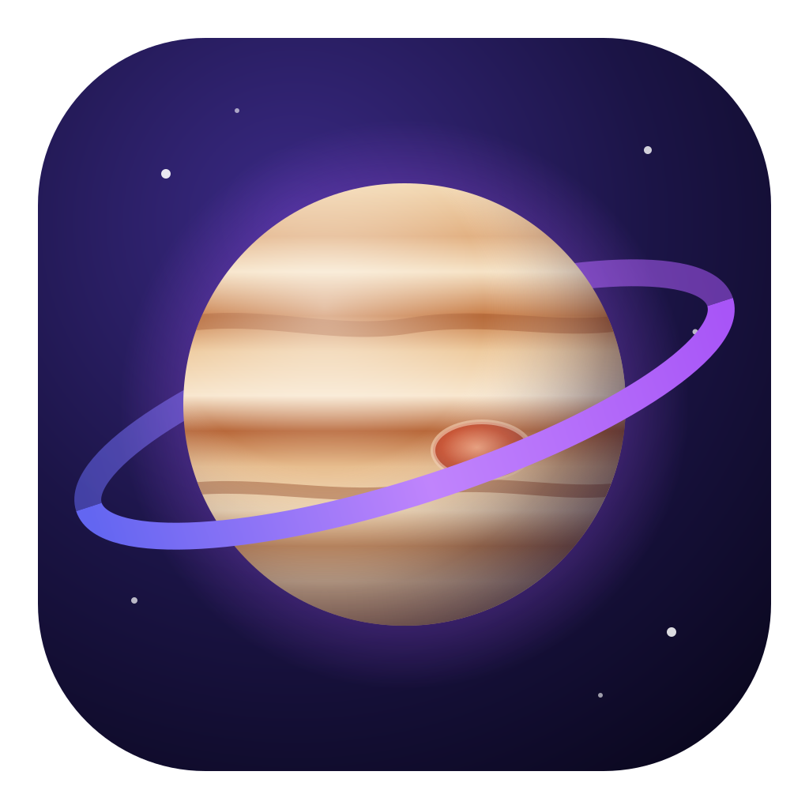

<p align="center">
  
</p>

<h1 align="center">Jupiter</h1>

<p align="center">Navegador web de escritorio hecho con <strong>Electron</strong>, <strong>React</strong> y <strong>TypeScript</strong>.</p>

## Descargar

Los instaladores están en [Releases](https://github.com/gmolletones-bot/jupiter/releases/latest). Una vez instalado, Jupiter se actualiza solo.

- **Windows**: `jupiter-<versión>-setup.exe`. El instalador no está firmado, así que Windows puede mostrar «Windows protegió su PC»: pulsa **Más información → Ejecutar de todas formas**.
- **Linux (Debian, Ubuntu, Mint…)**: `sudo apt install ./jupiter_<versión>_amd64.deb`
- **Linux (cualquier distribución)**: `chmod +x jupiter-<versión>.AppImage` y ábrelo.

## Funciones

- **Pestañas** con título, favicon y barra de título integrada (como Chrome o Brave).
- **Barra de direcciones inteligente**: autocompletado, sugerencias del historial, marcadores y buscador.
- **Paleta de comandos** (Ctrl+K): pestañas, acciones, marcadores e historial en un solo buscador.
- **Escudos**: bloqueador de anuncios y rastreadores con EasyList, EasyPrivacy y las listas de uBlock Origin (motor de Ghostery), incluidos los anuncios de YouTube y los avisos de cookies. Se puede desactivar por sitio y muestra estadísticas semanales.
- **Página de inicio personalizable**: reloj, clima, temporizador Focus (Pomodoro), sonidos ambientales, playlists de YouTube y Spotify, accesos directos y fondos animados de día y de noche.
- **Modo Focus**: mientras corre el Pomodoro, bloquea las webs que distraen.
- **Personalización**: tema claro u oscuro, color de acento, colores de cada web en la barra, efecto Mica (Windows 11), fondos propios y redondez de las esquinas.
- **Historial, marcadores** con barra de marcadores, **búsqueda en la página**, zoom y menú contextual.
- **Extensiones de Chrome** descomprimidas (compatibilidad parcial).
- **Actualizaciones automáticas** desde GitHub Releases y aceleración de vídeo por GPU (VA-API en Linux).

## Desarrollo

Requiere Node.js 22 o superior.

```bash
npm install
npm run dev
```

Comprobaciones:

```bash
npm run typecheck
npm run lint
```

## Generar instaladores

```bash
# Windows (desde Windows): dist/jupiter-<versión>-setup.exe
npm run build:win

# Linux (desde Linux o WSL): dist/*.AppImage y dist/*.deb
npm run build:linux
```

Guía paso a paso para Linux (incluido Linux Mint y WSL): [docs/COMO-EXPORTAR-PARA-LINUX.txt](docs/COMO-EXPORTAR-PARA-LINUX.txt).

## Publicar una versión

Los instaladores se generan en GitHub y Jupiter se actualiza solo desde las
[Releases](https://github.com/gmolletones-bot/jupiter/releases):

```bash
npm version minor        # 1.0.0 -> 1.1.0 (o "patch" para 1.0.1); crea el commit y la etiqueta
git push --follow-tags   # GitHub compila Windows y Linux y publica la Release
```

Las copias instaladas descargan la versión nueva en segundo plano y avisan para reiniciar
(Configuración → Sistema). Dependabot propone cada lunes actualizar Electron y el resto de
dependencias.

## Estructura

- `src/main/`: proceso principal (ventana, pestañas, historial, extensiones, bloqueador).
- `src/preload/`: puente seguro entre la interfaz y el proceso principal, y el preload de los Escudos.
- `src/renderer/`: interfaz en React (pestañas, barra de direcciones, página de inicio, configuración).

## Licencias de terceros

El bloqueador usa [`@ghostery/adblocker`](https://github.com/ghostery/adblocker) (MPL-2.0) y listas de filtros de EasyList y uBlock Origin. La letra manuscrita es [Caveat](https://fonts.google.com/specimen/Caveat) (OFL).
